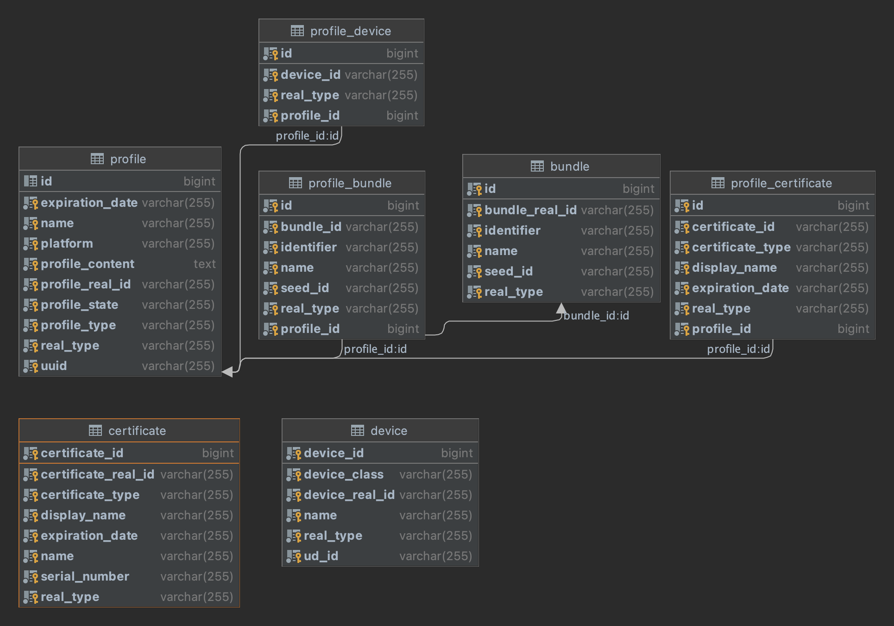
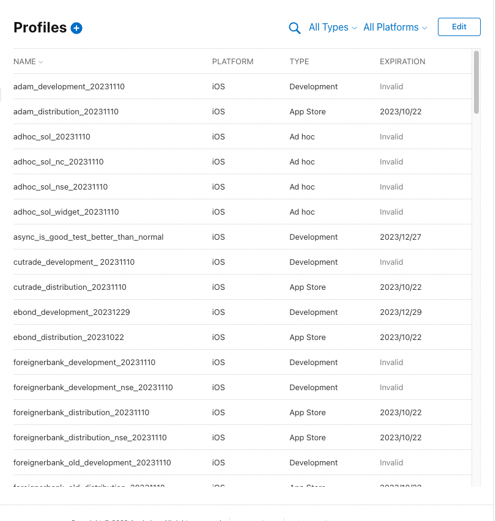
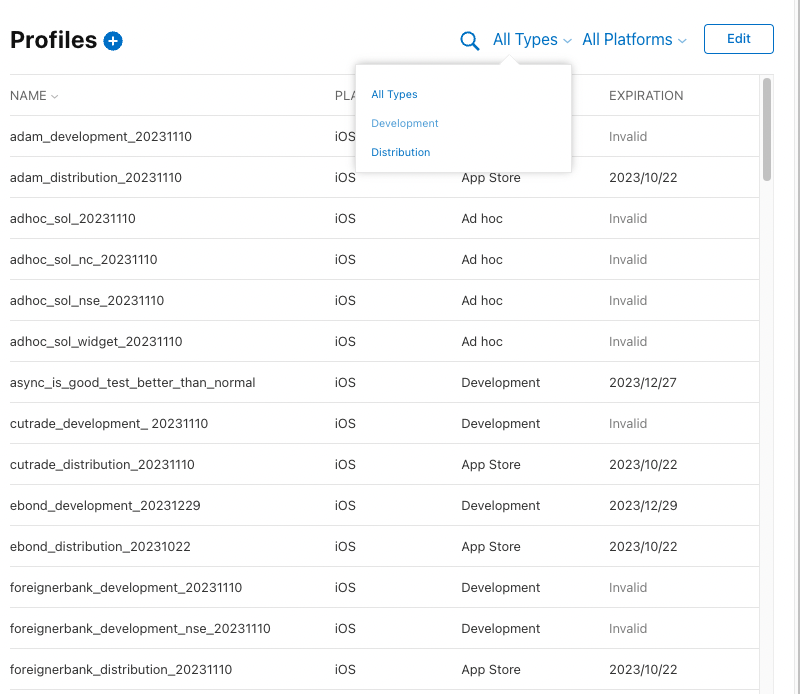
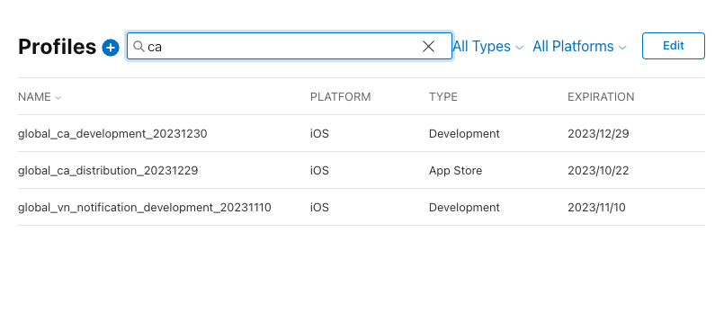
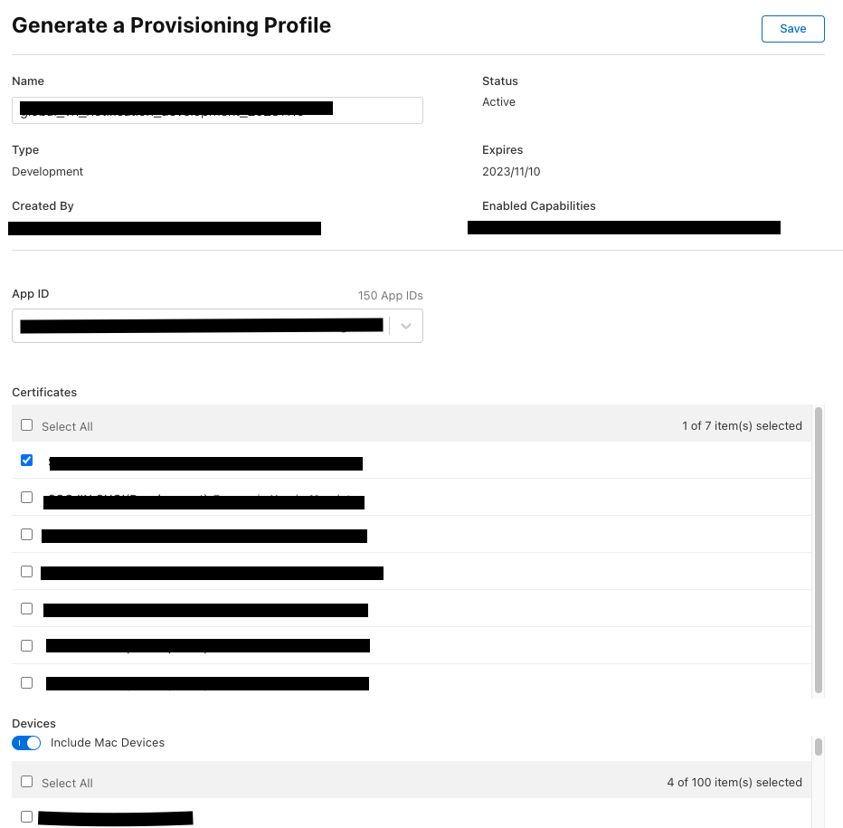

# 개요
- 프로젝트명: provisioningWebService
- 개발인원: 2명(백엔드 1, 프론트 1)
- 개발기간: 2022.12.09 ~ 2022.12.30
- 주요 기능: 프로비저닝 리스트 조회, 프로비저닝 재발급
- 개발 언어: Java 8, React
- 환경: SpringBoot 2.7.6, gradle 7.5.1, Spring Data JPA, QueryDSL
- DB: MySQL
- 형상관리: Git
- CI/CD: Jenkins
- 소개: 타 부서에서 ios 프로비저닝 갱신 요청이 자주옵니다. 이걸 지원하다보니 업무 집중도가 떨어질 때 가 있었는데요.. 
- 이젠 이 과정을 자동으로 만들고자 해당 프로젝트를 기획하였습니다.

# 요구사항
1. 프로비저닝 조회 
- 유저는 현재 존재하는 프로비저닝 리스트를 조회 할 수 있어야합니다.
- 타입으로 조회가 가능해야 합니다.
- 이름으로 조회가 가능해야 합니다.
2. 프로비저닝 재발급
- 유저는 프로비저닝 재발급이 가능해야 합니다.
- 프로비저닝 이름을 수정할 수 있어야 합니다.
- 프로비저닝에 등록할 디바이스를 선택할 수 있어야 합니다.
- 프로비저닝에 사용할 인증서를 선택할 수 있어야 합니다.
- 프로비저닝에 사용할 번들 ID를 선택할 수 있어야 합니다.
- SVN에 저장될 경로를 고를 수 있어야 합니다.

# DB 구조

전체적으로 중심이 되는 곳은 Profile입니다. 프로비저닝을 재발급하는 서비스다 보니 이렇게 설계를 하였습니다.
매번 API 요청을 해서 해당 프로비저닝과 매핑된 디바이스, 인증서를 가져오는건 비효율적이고 시간적 특성상 효율적이지 않다고 생각했습니다.
(사용자에게 빠른 화면을 제공해야 하는데 API 통신상 1~2초가 걸리고 데이터 가공 시간까지 포함하면 많이 느려집니다...)
이와 같은 이유로 Bundle, Device, Certificate 테이블을 구성하고 프로비저닝과 매핑되는 각 테이블의 관계를
ProfileDevice, ProfileCertificate, ProfileBundle로 나타냈습니다.
프로비저닝이 업데이트 되면 업데이트 후 받은 값을 파싱하여 연관된 테이블을 업데이트 시켜줍니다.
그리고 새로 발급된 프로비저닝 컨텍스트를 디코딩후 SVN 경로에 올려 프로비저닝 파일을 관리합니다.
현재 요청 -> 프로비저닝 발급 프로세스에서 재발급을 원하는 유저가 직접 재발급후 기존 SVN 경로에서 다운로드가 가능하기 때문에 업무
효율성이 상당히 증진되었습니다. 해당 프로젝트는 그 공로를 인정받아 23년 1월부터 자사 그룹 계열사에 사용되는 SAppBuilder 앱에 추가될 예정입니다.

# API 
1. 프로비저닝 리스트 조회: 현재 발급된 프로비저닝 리스트를 조회 할 수 있습니다.
>curl --location --request GET 'http://52.78.85.10:8080/apple/profile/list'
2. 프로비저닝 수정 페이지: 프로비저닝 수정 페이지에 사용될 데이터를 제공합니다.
>curl --location --request GET 'http://52.78.85.10:8080/resources/profiles/edit/${프로비저닝ID}'
3. 프로비저닝 수정 요청: 프로비저닝 수정 요청을 하여 재발급을 진행합니다.
>curl --location --request POST 'http://52.78.85.10:8080/resources/profiles/edit/${프로비저닝ID}' \
--header 'Content-Type: application/json' \
--data-raw 생략....

# 와이어프레임
1. 프로비저닝 조회 페이지

2. 타입 검색

3. 이름 검색

4. 재발급

# Trouble Shooting

### JPA 연관관계 같이 삭제
1. orphanRemoval = true 연관관계가 끊어지면 같이 삭제한다. 다른 엔터티에서 해당 엔터티를 참조하면 사용 못함.
2. CascadeType.REMOVE 해당 엔터티를 삭제할때 연관된 엔터티를 갖는 애들을 삭제하는것. 다른 엔터티에서 참조해도 사용 가능하다.

### Spring Security 없이 CORS 전역 설정 안먹히는 이유
1. allowedOrigins cannot be * if allowCredentials is true. This is documented at Mozilla.org
내가 *으로 설정해도 credential을 false로 해야 먹힘.

### update 후 정보 변경이 안된 현상 발견했음
Transaction 종료가 제대로 안되서 발생한거 같음.
레벨 설정을 통해 해결완료.

### Delete 단건으로 삭제되는 현상
>@Modifying(clearAutomatically = true, flushAutomatically = true)
@Query("DELETE FROM ProfileDevice pd WHERE pd.profile = :profile")

Modifying 영속성 문제 해결을 위해 clearAutomatically, flushAutomatically true 필요함!

### Bulk Delete not support Cascade Option
JPA는 bulk 삭제시 cascade를 지원하지 않는다.

### Profile Select
> 프로파일 선택
> java -jar -Dspring.profiles.active=default

### SVNkit
우선 프로비저닝을 재발급하고 이를 다시 프로비저닝으로 만드는 과정은 성공적으로 마무리 되었다.
프로비저닝 파일은 svn 경로에 관리되기 때문에 이를 어떻게 해야 넘길 수 있을지 고민을 해야 했다.
선택지는 다음 3가지 였다.
1. 서버 경로에 취합하고 한번에 옮길까?
2. 스크립트 짜서 넘기기
3. 자바 코드로 가능한지 찾아보기

우선 1번을 선택하게 되면 전체적인 관리가 힘들것이란 생각이 들었다. 전체 경로에 넘기기 전까지
다른 사람은 최신화된 프로비저닝 파일을 받을 수 없다는점이 문제였다.
2번은 스크립트를 짜서 svn에 올려야 하는데 각 앱 프로비저닝 마다 경로가 존재한다. 하지만 이를 전부 각각
넣어주려면 많이 무리가 갈것이라 생각했다. 심지어 나중에 경로가 변경된다면..흠...
결국 남은 선택지는 3번인데 처음에는 어떻게 넘겨야 하는지 정보가 없었다.
그러다 SVNkit을 사용하면 넘길 수 있다는걸 알게 되었고 이를 적용해 svn에 올리는게 성공했다.

# 진행사항 
>12/16
- ProfileCertificate 생성 완료
- BundleId 있는지? 생성 완료
- ProfileBundleId 생성 완료
>12/22
- 프로비저닝 업데이트 기능 구현 완료
>12/27
- SVN 업로드 성공
- 전체 코드 리팩토링 필요.
