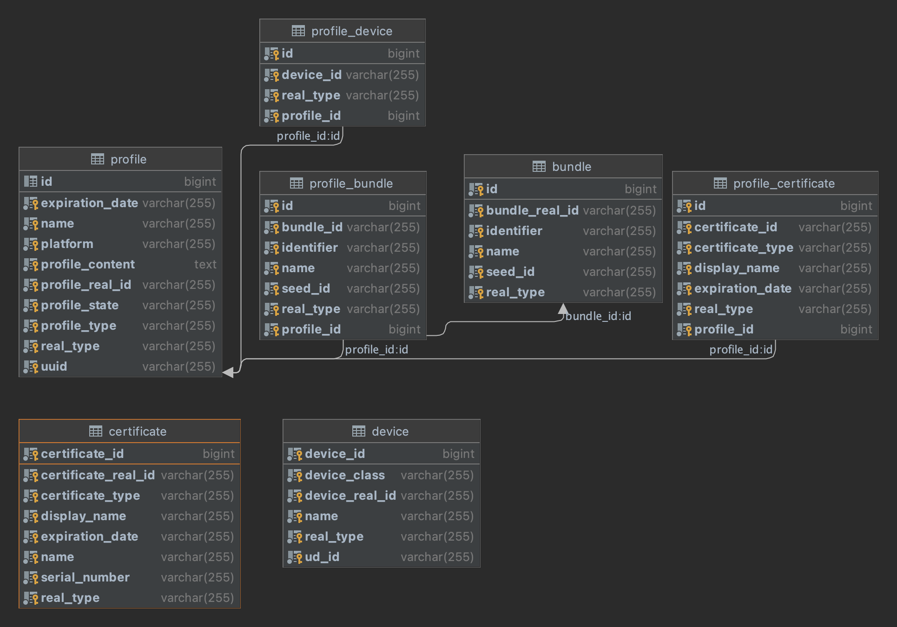

# provisioningWebService
타 부서에서 ios 프로비저닝 갱신 요청이 자주옵니다. 이걸 지원하다보니 업무 집중도가 떨어질 때 가 있었는데요.. 이젠 이 과정을 자동으로 만들고자 해당 프로젝트를 기획하였습니다.

## Diagram

## JPA 연관관계 같이 삭제
1. orphanRemoval = true 연관관계가 끊어지면 같이 삭제한다. 다른 엔터티에서 해당 엔터티를 참조하면 사용 못함.
2. CascadeType.REMOVE 해당 엔터티를 삭제할때 연관된 엔터티를 갖는 애들을 삭제하는것. 다른 엔터티에서 참조해도 사용 가능하다.

## Spring Security 없이 CORS 전역 설정 안먹히는 이유
1. allowedOrigins cannot be * if allowCredentials is true. This is documented at Mozilla.org
내가 *으로 설정해도 credential을 false로 해야 먹힘.

## 12/16 할거
ProfileCertificate 생성 완료
BundleId 있는지? 생성 완료
ProfileBundleId 생성 완료

## 12/22
update 후 정보 변경이 안된 현상 발견했음
Transaction 종료가 제대로 안되서 발생한거 같음.
다시 테스트 필요
>@Modifying(clearAutomatically = true, flushAutomatically = true)
@Query("DELETE FROM ProfileDevice pd WHERE pd.profile = :profile")
> Modifying 영속성 문제 해결을 위해 true 필요함!

JPA는 bulk 삭제시 cascade를 지원하지 않는다.